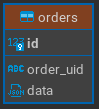

## NATS Streaming Service

**NATS Streaming Service** subscribes to NATS Streaming subject, reads orders and stores it in database. You can get orders using API.

### Data

Service is using PostgreSQL database. Database stores orders in `json` format. Scheme:



It also stores orders in lru cache.

### API

You can perform following requests:

1. **GET** `/` — returns index page with form to search order by id;
2. **POST** `/order` — request order by id.

### How to run the service

To launch service run:

```bash
docker compose up -d --build
```

To access API go to `127.0.0.1:8080`.
